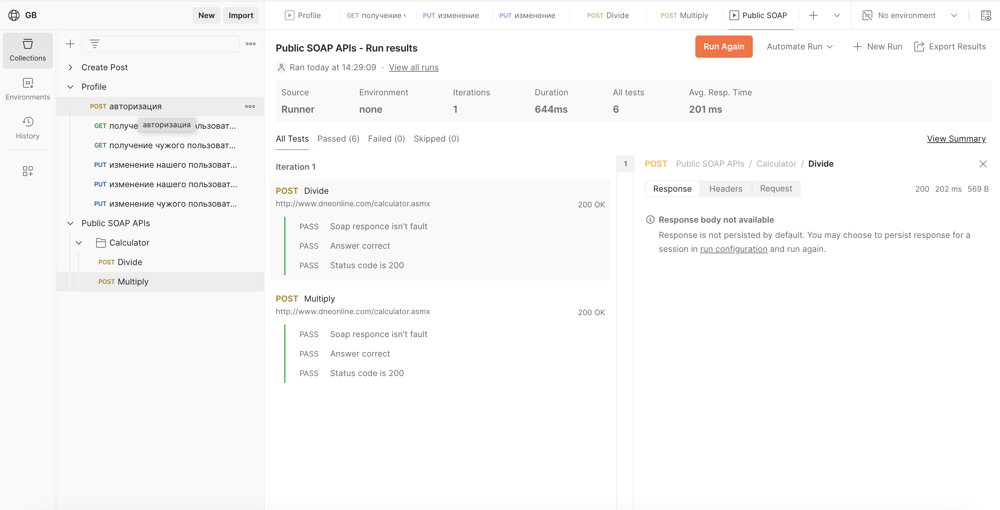

> ## Мои работы по промежуточным аттестациям в GeekBrains
### Введение в тестирование (Создание баг-репортов. Баг-трекинговые системы. Отчёты о тестировании) 

Задание:

Формат сдачи - ссылка на google-таблицу с правами на комментирование/редактирование. Создайте свою копию шаблона для ДЗ этого документа и выполните каждое задание в своей вкладке.

1. Заведите все баг-репорты на раздел «Вкусное меню на сегодня», найденные в чек-листе из ДЗ 2.

2. Опишите баг-репорт по видео. Представьте, что вам прилетел тикет из техподдержки (см. скрин тикета и воспроизведение бага ниже). Опишите, опираясь на информацию в тикете и на видео, баг-репорт.

* [Тикет от поддержки](https://gbcdn.mrgcdn.ru/uploads/asset/5924712/attachment/9682a920aeea0325434e271fe41946df.png).
* [Видео воспроизведения бага](https://gbcdn.mrgcdn.ru/uploads/asset/5924720/attachment/fe7ae1fe417ffa39d6dde388ee5ecb9d.mp4). 

3. Протестируйте разделы «Меню на сегодня» и «Наши повара» проекта [FoodBuzz](https://test-stand.gb.ru/seminar_stands/foodbuzz/index.html) и заведите все найденные баги. 

***
Ответ:
* [Документ с выполненной работой по заданию](https://docs.google.com/spreadsheets/d/1CbFR00kB1xc_6ZczDpVnwAMteC_NyI--/edit?pli=1&gid=886775295#gid=886775295)
*** 

### Основы ручного тестирования (Тестирование проекта)

Задание:

Необходимо подготовить отчет о тестировании Проекта  https://test-stand.gb.ru/seminar_stands/payform/index.html, 
Документация: https://docs.google.com/document/d/1w_yhOU8x9miePJRXe2e-sbAFC0Vy67jsv_e49kBVoEI/edit , где отразить в каком состоянии находится фича, можно ли ее зарелизить. 
Если нельзя, то почему, если можно, то также объяснить и привести все факты, доказывающие готовность функционала к релизу. Отчет сдать в формате .pdf."							
                            
***  
Ответ:                        
* [Отчет о тестировании](./docs/Отчет%20о%20тестировании.pdf "Отчет о тестировании") 
***

### Тест-дизайн и тест-аналитика (Составление отчета о тестировании)

Задание:

Формат сдачи: google таблица с правами на редактирование. Все необходимые ссылки в самом задании.

Составьте отчёт по имеющимся метрикам. [Файл с заданием](https://gbcdn.mrgcdn.ru/uploads/asset/5817783/attachment/f7075c3df74a3f62805d8ff6967e0398.pdf)
 
***
Ответ:
* [Документ с выполненной работой по заданию](https://docs.google.com/spreadsheets/d/1zXko0dANn2vmmnOeuDeNkYbrNWslDE1sUDynxaBcvjg/edit?gid=0#gid=0)
***

### Тестирование API (SOAP API)

Задание:

1. Импортировать коллекцию [Public SOAP APIs.postman_collection.json](https://gbcdn.mrgcdn.ru/uploads/asset/5264122/attachment/2e11fde58958e362418367d93eb30f09.json) 
2. Написать тесты на проверку значений в ответе на функцию умножения и деления
3. Экспортировать коллекцию с написанными тестами (т.е. приложить в ответ на дз файл с коллекций)
4. Сделать скриншот запущенной коллекции, где будет видно, что ваши тесты пройдены (приложить скриншот в ответ на дз)

***
Ответ:
* [ссылка на Postman](https://www.postman.com/lunar-module-geoscientist-22789716/gb/request/rrv38ay/multiply?tab=scripts)
* [Postman файл](./docs/Public%20SOAP%20APIs.postman_collection.json) 
* 
***

### Тестирование веб-приложений (Тестирование форм)

Задание:

Работа с формой: https://test-stand.gb.ru/seminar_stands/CakeLand-main/contact.html

- составить чек-листы по ТЗ (расположите в файле)
- протестировать
- завести баг-репорты (прикрепите скрины 5-ти)

Техническое задание:

Форма имеет заголовок "Форма обратной связи"

Поле имя имеет тип text и минимальная длина имени - 1 символ, а максимальная - 25. Поле обязательное для заполнения. Если пользователь не указывает в поле данные, то отображается ошибка "Заполните поле", если пользователь указал данные в поле в некорректном формате, то отображается ошибка "Неверный формат".

Поле email имеет тип email. Поле обязательное для заполнения. Если пользователь не указывает в поле данные, то отображается ошибка "Заполните поле", если пользователь указал данные в поле в некорректном формате, то отображается ошибка "Неверный формат введенных данных".

Поле номер телефона имеет тип text и минимальная длина номера - 10 символов, а максимальная - 18. Поле обязательное для заполнения. Если пользователь не указывает в поле данные, то отображается ошибка "Заполните поле", если пользователь указал данные в поле в некорректном формате, то отображается ошибка "Неверный формат".

Поле сообщение имеет тип text и минимальная длина имени - 1 символ, а максимальная - 250. Поле обязательное для заполнения. Если пользователь не указывает в поле данные, то отображается ошибка "Заполните поле", если пользователь указал данные в поле в некорректном формате, то отображается ошибка "Неверный формат".

Для полей: имя, сообщение допустимы символы - кириллица, латиница, цифры (кроме поля имя).
Для поля номер телефона допустимы только цифры и символы: плюс, пробел, открывающиеся и закрывающиеся скобки, дефис.

На форма имеется кнопка "отправить", при нажатии на которую выполняется проверка на клиенте и далее отправляются данные. При успешно отправленном сообщении отображается успешное сообщение "Ваше сообщение отправлено".

***
Ответ:
* [Документ с выполненной работой](https://docs.google.com/spreadsheets/d/1PZob4cBBvfOK5mHrnZ1mSxT2AklmbprkYXDQOxlVKwM/edit?gid=0#gid=0)
***

### Итоговая контрольная работа по блоку специализация

Задание:

В данном уроке вам необходимо выполнить практическое задание, которое расположено в документе по [ссылке](https://docs.google.com/document/d/1-9orkh2zTb75RV5ezPWXkwjwhL6zfzIXGReg2qN_pmo/edit?tab=t.0#) . Там вы найдете формат сдачи и флоу работы с шаблоном.

***
Ответ:
* [Документ с выполненной работой](https://docs.google.com/document/d/1R6k3GfbjMC5JpUrsc0yoAqkOQz5a6zqGrbJrsYFaxog/edit?tab=t.0)
***
